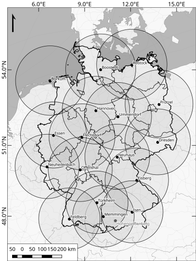

# Summary

<!-- The software should be open source as per the OSI definition. -->
<!--     The software should have an obvious research application. -->
<!--     You should be a major contributor to the software you are submitting. -->
<!--     The software should be a significant contribution to the available open source software that either enables some new research challenges to be addressed or makes addressing research challenges significantly better (e.g., faster, easier, simpler). -->
<!--     The software should be feature-complete (no half-baked solutions) and designed for maintainable extension (not one-off modifications). Minor ‘utility’ packages, including ‘thin’ API clients, are not acceptable. -->
<!--     Your paper (paper.md and BibTeX files, plus any figures) must be hosted in a Git-based repository, ideally together with your software. -->

Precipitation is of paramount importance when studying the water cycle which in turn drives the global climate and climate change.
Good kowledge on the parts of this mass and energy system is much needed to study different events, e.g. droughts, that may impact humans in their daily life.
For example soil moisture and land cover and therefore agriculture hence food production is highly dependent on rainfall.
Science on hydroclimatic extremes investigates atmospheric conditions which may lead to devastating flooding events.
Accurate input to improve hydrological model setups is a necessity for these scientific groups.
Also, general climate modeling also require precise precipitation data to validate against.
However, hydrological modeling communities struggle to get reliable data for this essential climate valiable (ECV).

There are several measuring methods for precipitation with the most prominent in society being traditionl gauge data.
Only measuring on point scale with limited informative value for nearby areas (kilometers) already is a big downside when it comes to hydrological applications.
A spatial representative precipitation data set is thus required.
In the last decades satellite missions where launched to measure precipitation from space.
These data sets come with peculiar uncertainties (e.g. winter) and resolutions up to .1° / ~10 km (Global Precipitation Measurement Mission).
Weather radars also provide areal representations of the rainfall around the station's location and can deliver data at a high sampling rate and spatial resolution.

RADOLAN is the weather radar system in Germany operated by the Deutscher Wetterdienst (DWD). The data set is
quirky home-grown geographic

, not used much

The forces on stars, galaxies, and dark matter under external gravitational

fields lead to the dynamical evolution of structures in the universe. The orbits
of these bodies are therefore key to understanding the formation, history, and
future state of galaxies. The field of "galactic dynamics," which aims to model
the gravitating components of galaxies to study their structure and evolution,
is now well-established, commonly taught, and frequently used in astronomy.
Aside from toy problems and demonstrations, the majority of problems require
efficient numerical tools, many of which require the same base code (e.g., for
performing numerical orbit integration).

``Gala`` is an Astropy-affiliated Python package for galactic dynamics. Python
enables wrapping low-level languages (e.g., C) for speed without losing
flexibility or ease-of-use in the user-interface. The API for ``Gala`` was
designed to provide a class-based and user-friendly interface to fast (C or
Cython-optimized) implementations of common operations such as gravitational
potential and force evaluation, orbit integration, dynamical transformations,
and chaos indicators for nonlinear dynamics. ``Gala`` also relies heavily on and
interfaces well with the implementations of physical units and astronomical
coordinate systems in the ``Astropy`` package [@astropy] (``astropy.units`` and
``astropy.coordinates``).

``Gala`` was designed to be used by both astronomical researchers and by
students in courses on gravitational dynamics or astronomy. It has already been
used in a number of scientific publications [@Pearson:2017] and has also been
used in graduate courses on Galactic dynamics to, e.g., provide interactive
visualizations of textbook material [@Binney:2008]. The combination of speed,
design, and support for Astropy functionality in ``Gala`` will enable exciting
scientific explorations of forthcoming data releases from the *Gaia* mission
[@gaia] by students and experts alike.

# Mathematics

Single dollars ($) are required for inline mathematics e.g. $f(x) = e^{\pi/x}$

Double dollars make self-standing equations:

$$\Theta(x) = \left\{\begin{array}{l}
0\textrm{ if } x < 0\cr
1\textrm{ else}
\end{array}\right.$$

# Citations

Citations to entries in paper.bib should be in
[rMarkdown](http://rmarkdown.rstudio.com/authoring_bibliographies_and_citations.html)
format.

For a quick reference, the following citation commands can be used:
- `@author:2001`  ->  "Author et al. (2001)"
- `[@author:2001]` -> "(Author et al., 2001)"
- `[@author1:2001; @author2:2001]` -> "(Author1 et al., 2001; Author2 et al., 2002)"

# Figures

Figures can be included like this: 

# Acknowledgements

We acknowledge DWD for providing the RADOLAN data in an open manner and free of charge.

# References
